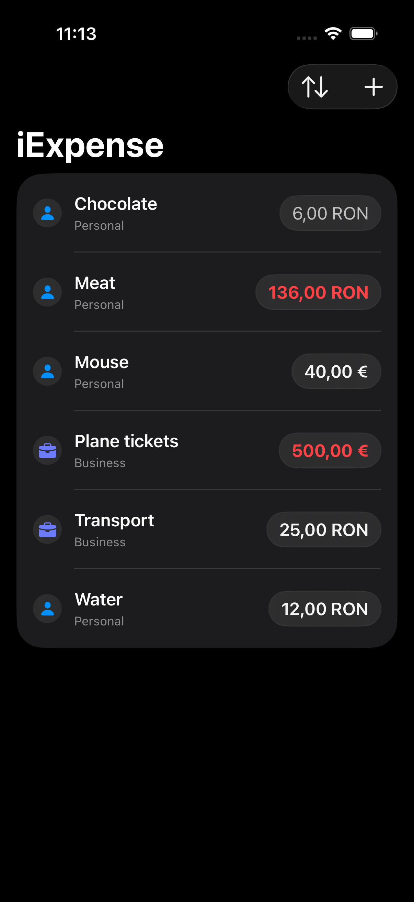

# iExpense

A SwiftUI-based expense tracking application featuring local persistence, multi-currency support, and dynamic sorting and filtering.

---

## Screenshots

  
  

---

## Features

### Expense Management
- Add expenses with name, type, amount, and currency
- Delete expenses using native swipe gestures

### Sorting & Filtering
- Sort expenses by name or amount
- Filter expenses by:
  - All
  - Personal
  - Business
- Dynamic list updates based on selected options

### Persistence
- Local storage using SwiftData
- Automatic data updates via reactive queries (`@Query`)
- No manual save/load logic required

### Multi-Currency Support
- Currency picker using ISO currency codes
- Locale-aware currency formatting
- Per-expense currency handling

### Conditional Styling
- Amount styling based on value thresholds:
  - Low (< 10)
  - Medium (< 100)
  - High (≥ 100)
- Reusable `ViewModifier` for amount formatting

---

## Demo

Short demo video:

[Watch the demo on LinkedIn](https://www.linkedin.com/posts/edward-andrei-radu_swift-swiftui-iosdevelopment-activity-7434578608397897728-ME_R)

---

## Technologies

- Swift
- SwiftUI
- SwiftData (`@Model`, `@Query`, `modelContext`)
- Observation system
- Locale & currency APIs

---

## Learning Context

Built as part of **Hacking with Swift – SwiftUI (Project 7)**  
https://www.hackingwithswift.com/books/ios-swiftui

Extended beyond the base tutorial with:
- Migration from UserDefaults to SwiftData
- Dynamic sorting and filtering
- Multi-currency support
- Conditional UI styling
- Reusable view abstractions
